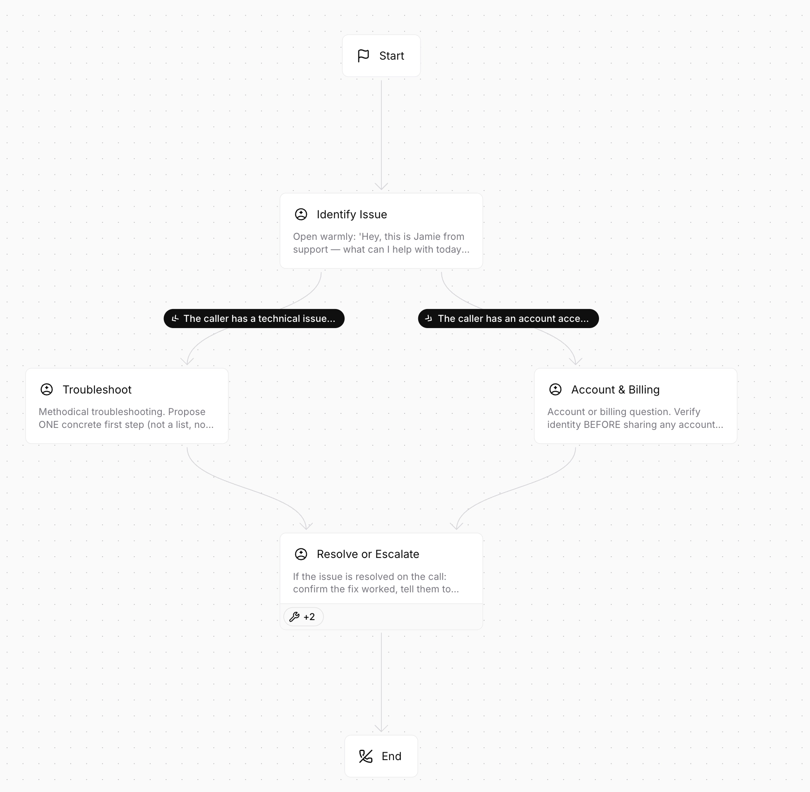

# Product Engineer Challenge

Prosper builds voice AI for healthcare phone calls across several use cases. Our largest is **appointment scheduling**. This challenge has two phases. Plan to spend roughly 8–12 hours on it.

## Phase 1 — Voice Agent Builder

Build a UI for creating and editing voice agents, where an agent is an **graph of nodes** — each node a step in the conversation, each edge a transition the agent can take. A user should be able to edit the node graph and place a test call from the UI, similar to existing products like [ElevenLabs Agents](https://elevenlabs.io/) or [Retell AI](https://www.retellai.com/) (see the reference screenshot below).

### What's already built

The starter code lives in the [prosper-challenge-agent-copilot](https://github.com/Prosper-Technologies/prosper-challenge-agent-copilot) repository. The backend is already in place: a [Pipecat](https://github.com/pipecat-ai/pipecat) voice pipeline (WebRTC + ElevenLabs STT/TTS + OpenAI LLM) whose conversation is a **node graph** built with Pipecat Flows. An agent is defined declaratively as JSON and compiled into a runnable flow at runtime by an `AgentBuilder`, and can be exercised through a browser test call.

The repo ships an example agent (`backend/example_flow.json`) purely to illustrate the format — it's a sample, not the agent you're expected to use; build whatever agent fits your solution.

Phase 1 therefore comes down to **building the UI to edit those nodes** — the agent representation and the voice runtime already exist, though you're welcome to change either (the node format, the backend) if you think you can do better.

## Phase 2 — Agent Copilot

This is the more open-ended — and, to us, the more interesting — part of the challenge. Today, our deployment team spends a significant amount of time on two manual workflows:

**Initial implementation** — translating a client's natural-language guidelines into a working agent.

**Production iteration** — refining agents in response to issues flagged by clients, or surfaced directly from call data. Even the detection of these issues in the calls is a burden.

Now that you have a platform for building agents, design an **AI Copilot** that automates this work — much as AI coding tools (Claude Code, Cursor, etc.) automate software development. We're looking for a novel approach that lets a user rapidly create and iterate on agents from natural-language input and production feedback. Treat this as an open design problem and propose the best solution you can to solve the problems mentioned above.

We don't provide real call data — feel free to mock a few example calls or flagged issues to showcase the iteration loop.

## Requirements

- A minimal UI where a user can create an agent and place a test call.
- An Agent Copilot integrated in this UI.

We'll provide API keys for OpenAI and ElevenLabs separately, but feel free to use other providers if you prefer.

## What we'll value

**Originality of the Agent Copilot (Phase 2)** — this is the heart of the challenge. A thoughtful, easy-to-use, novel approach matters more than a feature-complete builder.

**Resolution of the problem** — the extent to which the solution solves the problems outlined before.

**Pragmatic scoping** — what you chose to build, mock, or leave out, and the reasoning behind it. Knowing what *not* to build is a signal.

**Product sense and quality of work** — does the solution actually reduce the manual work our deployment team does today? We value solutions that target the real bottleneck over polished but tangential work.

**A flashy demo** — during the challenge review we'll ask you to walk us through a live, end-to-end demo of what you built, so make sure it's something you can show off.

## AI coding

We highly encourage you to use AI tools (Claude Code, Cursor, etc.) to help with this challenge. We don't mind if you "vibe code" most of it — that usually signals strong prompting skills. What matters is that you can explain and defend the decisions and trade-offs behind your solution.

## Submission

Submit a link to a repository containing your code and a `solution.md` file with an overview of your solution and the key architectural decisions you made.

